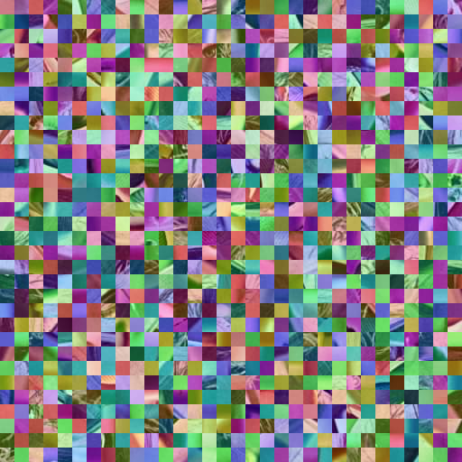

This project was inspired by observing image obfuscation techniques used in the wild for content sharing. Out of curiosity about the underlying mechanics, I researched a related academic paper and implemented this system.  

这个项目的灵感来自于观察真实网络环境中用于内容分享的图片混淆技术。出于对底层机制的好奇，我研究了一篇相关学术论文并复现了这个系统

# JPEG Encryption-then-Compression (EtC) System

[](https://www.python.org/)
[](https://www.google.com/search?q=LICENSE)

An unofficial Python implementation of the paper **"An Encryption-then-Compression System for JPEG Standard"** (Kurihara et al.). This tool allows images to be scrambled (encrypted) while maintaining compatibility with standard JPEG compression algorithms, ensuring they can be restored flawlessly after compression.

## 🎯 NEW: YOLOv5 Detection Agent for Jetson Nano

This repository now includes a high-performance object detection system optimized for NVIDIA Jetson Nano! Features include:

- **TensorRT Acceleration** with FP16 precision for Maxwell GPU
- **CUDA Stream async processing** for maximum performance
- **Memory circuit breaker** to prevent OOM (< 200MB threshold)
- **CSI Camera support** with GStreamer pipeline
- **Complete toolchain** from model conversion to deployment

👉 **[See Detection Agent Documentation](README_DETECTION.md)**

-----

## 🖼️ Demo

### 1. Encryption Effect

|                  Original                  |                   Encrypted                    |                   Restored                    |
| :----------------------------------------: | :--------------------------------------------: | :-------------------------------------------: |
|  |  |  |

> **Note**: The encrypted image is robust against JPEG compression (Quality Factor ≥ 95 recommended).

### 2. System Architecture

[cite_start]The system applies 4 block-based encryption steps to align with JPEG's 16x16 MCU structure[cite: 1, 6].

-----

## 📂 Project Structure

```text
ENCRYPTION_THEN_COMPRESSION
├── assets/                       # Demo images & diagrams
├── docs/                         # Documentation & Notes
│   ├── learning_note.md          # Algorithm analysis
│   └── jetson_nano_setup.md      # Jetson Nano environment setup
├── src/                          # Source Code
│   ├── etc_tool.py               # JPEG encryption tool
│   ├── trt_engine.py             # TensorRT inference engine
│   └── yolov5_agent.py           # YOLOv5 detection agent
├── requirements.txt              # Dependencies
├── setup_jetson.sh               # Jetson Nano setup script
├── run_detection.py              # Detection main script
├── README.md                     # This file
└── README_DETECTION.md           # Detection agent documentation
```

-----

## 🚀 Features

  * [cite_start]**JPEG Compatibility**: Strictly uses **16x16 blocks** to support JPEG chroma subsampling (4:2:0)[cite: 186].
  * [cite_start]**4-Layer Encryption**[cite: 19]:
    1.  **Block Scrambling**: Permutes the position of blocks.
    2.  **Block Rotation/Inversion**: Rotates and flips blocks randomly.
    3.  **Negative Transformation**: Inverts pixel values.
    4.  **Color Shuffling**: Permutes RGB channels within blocks.

-----

## 📦 Installation

1. **Clone the repository**

   ```bash
   git clone https://github.com/Yulong-Cauli/encryption-then-compression-jpeg.git
   cd encryption-then-compression
   ```

2. **Install dependencies**

   ```bash
   pip install -r requirements.txt
   ```

-----

## 🛠️ Usage

The main entry point is `src/etc_tool.py`.

### 1. Encrypt an Image

```bash
# Syntax: python src/etc_tool.py [INPUT] [OUTPUT] --mode encrypt --seed [KEY]

python src/etc_tool.py assets/input.jpg assets/encrypted.jpg --mode encrypt --seed 114514
```

### 2. Decrypt an Image

> **Warning**: The `--seed` MUST be exactly the same as used during encryption.

```bash
python src/etc_tool.py assets/encrypted.jpg assets/restored.jpg --mode decrypt --seed 114514
```

### 3. Parameters

| Argument       | Description                   | Default   |
| :------------- | :---------------------------- | :-------- |
| `input_file`   | Path to the source image      | Required  |
| `output_file`  | Path to save the result       | Required  |
| `--mode`       | `encrypt` or `decrypt`        | `encrypt` |
| `--seed`       | Integer key for randomization | `114514`  |
| `--block-size` | Block size (Keep 16 for JPEG) | `16`      |

-----

## 📚 Documentation

For detailed mathematical proofs and algorithm analysis, please refer to the learning notes:

👉 **[docs/learning_note.md](https://www.google.com/search?q=docs/learning_note.md)**

-----

## 🔗 Reference

This project is an implementation based on the following paper:

  * **Paper**: *An Encryption-then-Compression System for JPEG Standard*
  * **Authors**: Kenta Kurihara, Sayaka Shiota, and Hitoshi Kiya
  * **Conference**: Picture Coding Symposium (PCS), 2015
  * **DOI**: [10.1109/PCS.2015.7170059](https://www.google.com/search?q=https://doi.org/10.1109/PCS.2015.7170059)

-----

## 📄 License

This project is licensed under the MIT License.# Clone the repository

# Install dependencies

pip install -r requirements.txt


# JPEG 抗压缩图像混淆工具

这是一个基于论文 **"An Encryption-then-Compression System for JPEG Standard"** (Kurihara et al.) 的 Python 实现。本工具能在保持 JPEG 压缩兼容性的前提下对图像进行混淆（加密），确保加密后的图像即使经过 JPEG 压缩也能完美还原。

-----

## 🖼️ 演示

### 1. 加密效果

|                    原图                    |                     混淆后                     |                     还原                      |
| :----------------------------------------: | :--------------------------------------------: | :-------------------------------------------: |
|  |  |  |

> **注意**: 混淆后的图片完全抵抗 JPEG 压缩（推荐质量因子 ≥ 95）。

### 2. 算法流程

系统采用了4个基于块的加密步骤，以保持与 JPEG 16x16 MCU 结构的兼容性。

-----

## 📂 目录结构

```text
ENCRYPTION_THEN_COMPRESSION
├── assets/                 # 演示图片
├── docs/                   # 文档与笔记
│   └── learning_note.md    # 算法原理笔记
├── src/                    # 源代码
│   └── etc_tool.py         # 核心工具脚本
├── requirements.txt        # 依赖文件
└── README.md               # 说明文档
```

-----

## 🚀 特性

  * **JPEG 兼容**: 严格使用 16x16 分块以支持 JPEG 4:2:0 色度采样。
  * **四层加密**:
    1.  **块位置置乱**: 置乱块的位置。
    2.  **块旋转与翻转**: 随机旋转和翻转块。
    3.  **负片反转**: 反转像素值。
    4.  **颜色分量洗牌**: 置乱块内的 RGB 通道。

-----

## 📦 安装

1. **克隆仓库**

   ```bash
   git clone https://github.com/Yulong-Cauli/encryption-then-compression-jpeg.git
   cd encryption-then-compression
   ```

2. **安装依赖**

   ```bash
   pip install -r requirements.txt
   ```

-----

## 🛠️ 使用方法

主程序入口为 `src/etc_tool.py`。

### 1. 加密图片

```bash
# 语法: python src/etc_tool.py [输入] [输出] --mode encrypt --seed [密钥]

python src/etc_tool.py assets/input.jpg assets/encrypted.jpg --mode encrypt --seed 114514
```

### 2. 解密图片

> **警告**: 解密时使用的 `--seed` 必须与加密时完全一致。

```bash
python src/etc_tool.py assets/encrypted.jpg assets/restored.jpg --mode decrypt --seed 114514
```

### 3. 参数说明

| 参数           | 说明                    | 默认值    |
| :------------- | :---------------------- | :-------- |
| `input_file`   | 输入图片路径            | 必需      |
| `output_file`  | 输出图片路径            | 必需      |
| `--mode`       | 模式：加密或解密        | `encrypt` |
| `--seed`       | 随机数种子（即密钥）    | `114514`  |
| `--block-size` | 分块大小 (JPEG请保持16) | `16`      |

-----

## 📚 文档

关于算法的详细数学证明和原理分析，请查阅学习笔记：

👉 **[docs/learning_note.md](https://www.google.com/search?q=docs/learning_note.md)**

-----

## 🔗 参考文献

本项目基于以下论文实现：

  * **论文**: *An Encryption-then-Compression System for JPEG Standard*
  * **作者**: Kenta Kurihara, Sayaka Shiota, and Hitoshi Kiya
  * **会议**: Picture Coding Symposium (PCS), 2015
  * **DOI**: [10.1109/PCS.2015.7170059](https://www.google.com/search?q=https://doi.org/10.1109/PCS.2015.7170059)

-----

## 📄 License

This project is licensed under the MIT License.
